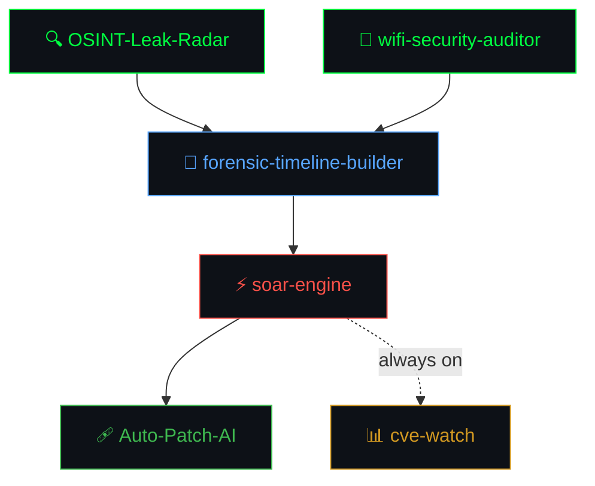

<i>Building security automation that actually gets deployed — not just demo'd.</i>

 

---

### The pipeline

Six tools. One workflow. Built from scratch.

 

| Stage | Tool | What it does |
|:---:|---|---|
| 🔍 Recon | **[OSINT-Leak-Radar](https://github.com/X-Abhishek-X/OSINT-Leak-Radar)** | Queries Wayback Machine CDX for `.env` files, SQL dumps, and private keys crawled years ago |
| 📡 Audit | **[wifi-security-auditor](https://github.com/X-Abhishek-X/wifi-security-auditor)** | WPA/WPA2 audit — OUI vendor lookup, WPS detection, PMKID capture without deauthentication |
| 🔬 Investigate | **[forensic-timeline-builder](https://github.com/X-Abhishek-X/forensic-timeline-builder)** | SSH log collection → unified timeline → auto-detection of brute force and privilege escalation |
| ⚡ Respond | **[soar-engine](https://github.com/X-Abhishek-X/soar-engine)** | FastAPI webhook → Redis queue → Celery workers. Async playbooks: VirusTotal enrichment + firewall block + Slack |
| 🩹 Patch | **[Auto-Patch-AI](https://github.com/X-Abhishek-X/Auto-Patch-AI)** | Trivy scans container → LLM (Groq free / OpenAI) writes patched Dockerfile. Free to run. |
| 📊 Monitor | **[cve-watch](https://github.com/X-Abhishek-X/cve-watch)** | NVD + EPSS enrichment. Ranks by `cvss × exploit_probability` — not just severity theatre |

 

---

  <picture>
    <source media="(prefers-color-scheme: dark)" srcset="https://raw.githubusercontent.com/X-Abhishek-X/X-Abhishek-X/output/snake-dark.svg" />
    <source media="(prefers-color-scheme: light)" srcset="https://raw.githubusercontent.com/X-Abhishek-X/X-Abhishek-X/output/snake.svg" />
    
  </picture>

 

---

### Stats

  
  &nbsp;
  

 

  

 

---

### Stack

