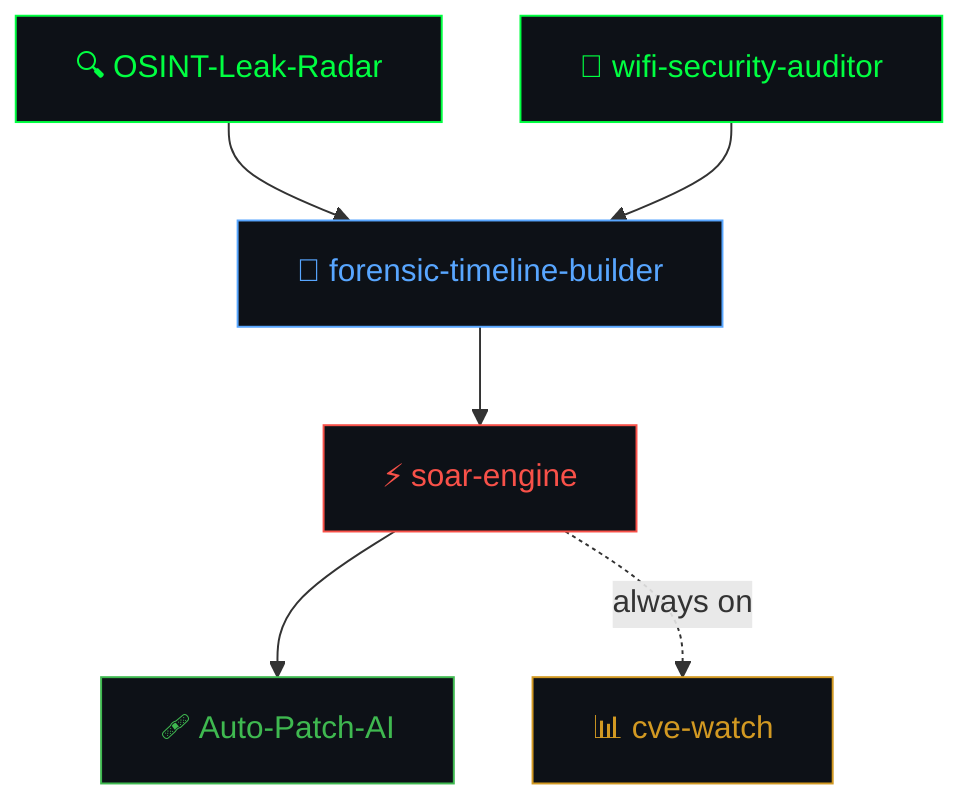

<i>Cybersecurity grad student. Applied ML research that escaped the lab. Building tools that get deployed — not just demo'd.</i>

 

---

### Security Pipeline

Six tools. One workflow. Built from scratch.

```mermaid
%%{init:{"flowchart":{"wrappingWidth":250,"nodeSpacing":40,"rankSpacing":50}}}%%
graph TD
    A["🔍 OSINT-Leak-Radar"] --> C["🔬 forensic-timeline-builder"]
    B["📡 wifi-security-auditor"] --> C
    C --> D["⚡ soar-engine"]
    D --> E["🩹 Auto-Patch-AI"]
    D -.->|always on| F["📊 cve-watch"]

    style A fill:#0d1117,stroke:#00ff41,color:#00ff41
    style B fill:#0d1117,stroke:#00ff41,color:#00ff41
    style C fill:#0d1117,stroke:#58a6ff,color:#58a6ff
    style D fill:#0d1117,stroke:#f85149,color:#f85149
    style E fill:#0d1117,stroke:#3fb950,color:#3fb950
    style F fill:#0d1117,stroke:#d29922,color:#d29922
```

 

| Stage | Tool | What it does |
|:---:|---|---|
| 🔍 Recon | **[OSINT-Leak-Radar](https://github.com/X-Abhishek-X/OSINT-Leak-Radar)** | Queries Wayback Machine CDX for `.env` files, SQL dumps, and private keys crawled years ago |
| 📡 Audit | **[wifi-security-auditor](https://github.com/X-Abhishek-X/wifi-security-auditor)** | WPA/WPA2 audit — OUI vendor lookup, WPS detection, PMKID capture without deauthentication |
| 🔬 Investigate | **[forensic-timeline-builder](https://github.com/X-Abhishek-X/forensic-timeline-builder)** | SSH log collection → unified timeline → auto-detection of brute force and privilege escalation |
| ⚡ Respond | **[soar-engine](https://github.com/X-Abhishek-X/soar-engine)** | FastAPI webhook → Redis queue → Celery workers. Async playbooks: VirusTotal enrichment + firewall block + Slack |
| 🩹 Patch | **[Auto-Patch-AI](https://github.com/X-Abhishek-X/Auto-Patch-AI)** | Trivy scans container → LLM (Groq free / OpenAI) writes patched Dockerfile. Free to run. |
| 📊 Monitor | **[cve-watch](https://github.com/X-Abhishek-X/cve-watch)** | NVD + EPSS enrichment. Ranks by `cvss × exploit_probability` — not just severity theatre |

 

---

### Other systems work

- **[Nvidia-Challenge](https://github.com/X-Abhishek-X/Nvidia-Challenge)** — gRPC GPU telemetry orchestrator. Distributed monitoring with auto-healing actions (node drain, alert escalation) on real-time GPU metrics.
- **[malware-deobfuscator](https://github.com/X-Abhishek-X/malware-deobfuscator)** — LLM-powered malware deobfuscation with IOC extraction and MITRE ATT&CK mapping.
- **[Morphe-Automated-Build-Scripts](https://github.com/X-Abhishek-X/Morphe-Automated-Build-Scripts)** — GitHub Actions pipeline that builds and releases 37 patched APKs every two days. Used by real users.

 

---

  <picture>
    <source media="(prefers-color-scheme: dark)" srcset="https://raw.githubusercontent.com/X-Abhishek-X/X-Abhishek-X/output/snake-dark.svg" />
    <source media="(prefers-color-scheme: light)" srcset="https://raw.githubusercontent.com/X-Abhishek-X/X-Abhishek-X/output/snake.svg" />
    
  </picture>

 

---

### Stats

  
  &nbsp;
  

 

---

### Stack

